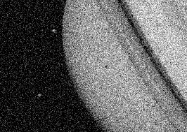
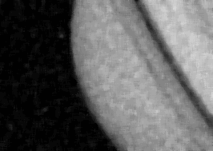
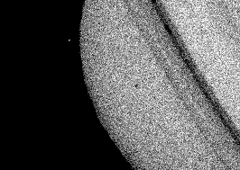
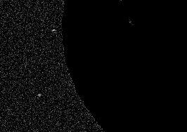

# Grayscale-Image-Information-Gain

A simple project to demonstrate information gain in grayscale images

## Steps
### Step 1
Load the provided image into the variable `i`.

### Step 2
Pass the provided image through a median 7x7 filter and save it in the variable `bi`.

### Step 3
Apply thresholding with the value 42 on the image `bi`. While the image is blurry due to applying the 7x7 median filter. It does not matter in this case since it is only used for the mask. The output mask is saved in the variable `binary_i`.

### Step 4
Use the mask `binary_i` to obtain the foreground from the original image by getting the values from the original image when the corresponding value of it in the mask is 255, and making the other pixels have the value 0. The outputted image is saved in the variable `fg_i`.

### Step 5
Use the mask `binary_i` to obtain the background from the original image by getting the values from the original image when the corresponding value of it in the mask is 0, and making the other pixels have the value 0. The outputted image is saved in the variable `bg_i`.

### Step 6

We get the entropy for the original image, the background and the foreground. We do that by calculating the probability of each colour in the image then summing the probability *  log2(1/probability) for all values (similar to the function mentioned in the lecture). However we ignore the pure black values as they may be the result of masking. 

We do this to avoid calculating the values removed from the background / foreground as values from the foreground/background as they have already been removed for example, when we calculate the entropy of the foreground, we will notice a lot of 0s even though they were supposedly removed in the background and are no longer supposed to be a part of neither the background nor the foreground. 

The entropy for the original image is saved in the variable `e_i`. The entropy for the foreground is saved in the variable `e_fg_i`. And the entropy of the background is saved in the variable `e_bg_i`.

### Step 7

We finally get the information gain. We do that by subtracting the new entropy values from the old one. To get the new entropy values, we multiply the foreground and background entropy values by their corresponding percentages in making up the entire image. We save that value in the variable `informationGain`.

## Results

|      Attribute     |        Value       |
|:------------------:|:------------------:|
|    Image entropy   |  4.701262861480791 |
| Foreground entropy |  4.823398322111051 |
| Background entropy | 2.6533520190081132 |
|  Information gain  | 0.7268648324781397 |

***
Done as a part of Introudction to Digital Media Engineering & Technology course.